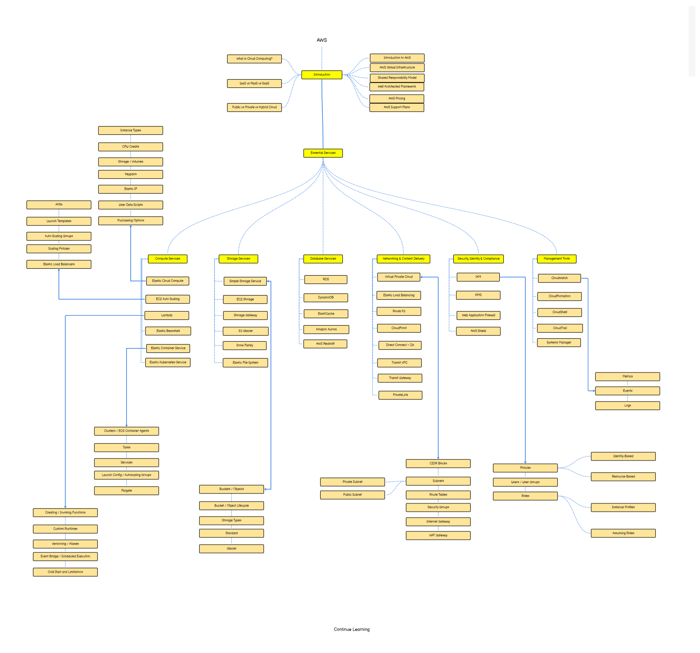

# AWS Cloud Fundamentals Course

Welcome to the AWS Cloud Fundamentals course! This course will provide you with a comprehensive understanding of the AWS cloud platform and its essential services.

## Course Overview

This course will cover the following key topics:

1. **Introduction to Cloud Computing:** Understand the basics of cloud computing, including its benefits, deployment models, and service models.

2. **AWS Infrastructure:** Explore the core infrastructure services offered by AWS, such as Elastic Compute Cloud (EC2), Simple Storage Service (S3), Virtual Private Cloud (VPC), and Identity and Access Management (IAM).

3. **AWS Management Tools:** Learn about AWS management tools like AWS Management Console, AWS Command Line Interface (CLI), and AWS Software Development Kit (SDK).

4. **Security and Compliance:** Understand AWS security best practices, compliance frameworks, and services like AWS Identity and Access Management (IAM), AWS Key Management Service (KMS), and AWS Config.

5. **Scalability and High Availability:** Explore techniques for designing highly scalable and available architectures on AWS using services like Auto Scaling, Elastic Load Balancing, and Amazon Route 53.

## Course Materials

Access the course materials and additional resources from the following link:

[Course Materials](https://drive.google.com/file/d/1zXShL2v1azKtmYK1ISlvWoK15UhwpVAc/view?usp=sharing)

## Roadmap

Below is the roadmap for the AWS Cloud Fundamentals course:

This roadmap outlines the key topics and milestones you'll cover throughout the course.
