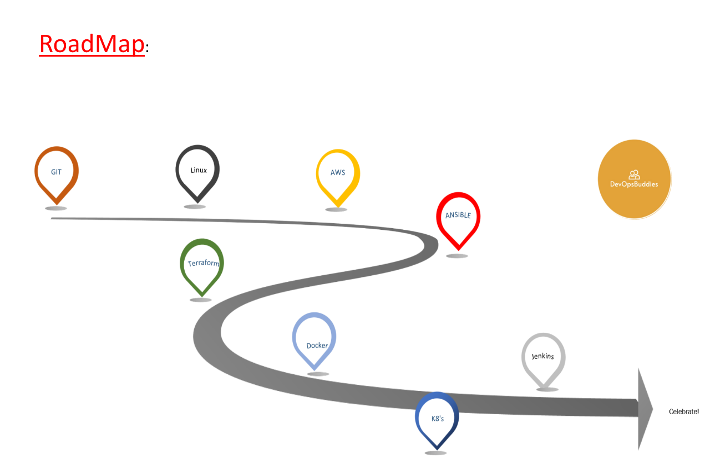

# AWS DevOps Course

Welcome to the AWS DevOps course! In this course, we will cover various topics related to DevOps practices and tools on the AWS platform.

## Course Overview

### Course Content

- **Linux Basics**: Learn the fundamentals of the Linux operating system, including basic commands, file system navigation, and shell scripting.
- **DevOps Principles**: Understand the core principles of DevOps, including continuous integration, continuous delivery, and infrastructure as code.
- **AWS Fundamentals**: Get introduced to essential AWS services and concepts, such as EC2, S3, VPC, and IAM.
- **Deployment Automation**: Explore tools like jenkins for automating the deployment process.
- **Monitoring and Logging**: Learn about AWS CloudWatch and AWS CloudTrail for monitoring and logging AWS resources and applications.

### Course Materials

You can access the course materials and resources from the following link:

[Course Materials](https://drive.google.com/file/d/1G2lHKI85rj1o0mjsPGnrq69UY30mkdOM/view?usp=sharing)

## Roadmap

Below is the roadmap for the AWS DevOps course:

This roadmap outlines the key topics and milestones you'll cover throughout the course. 

