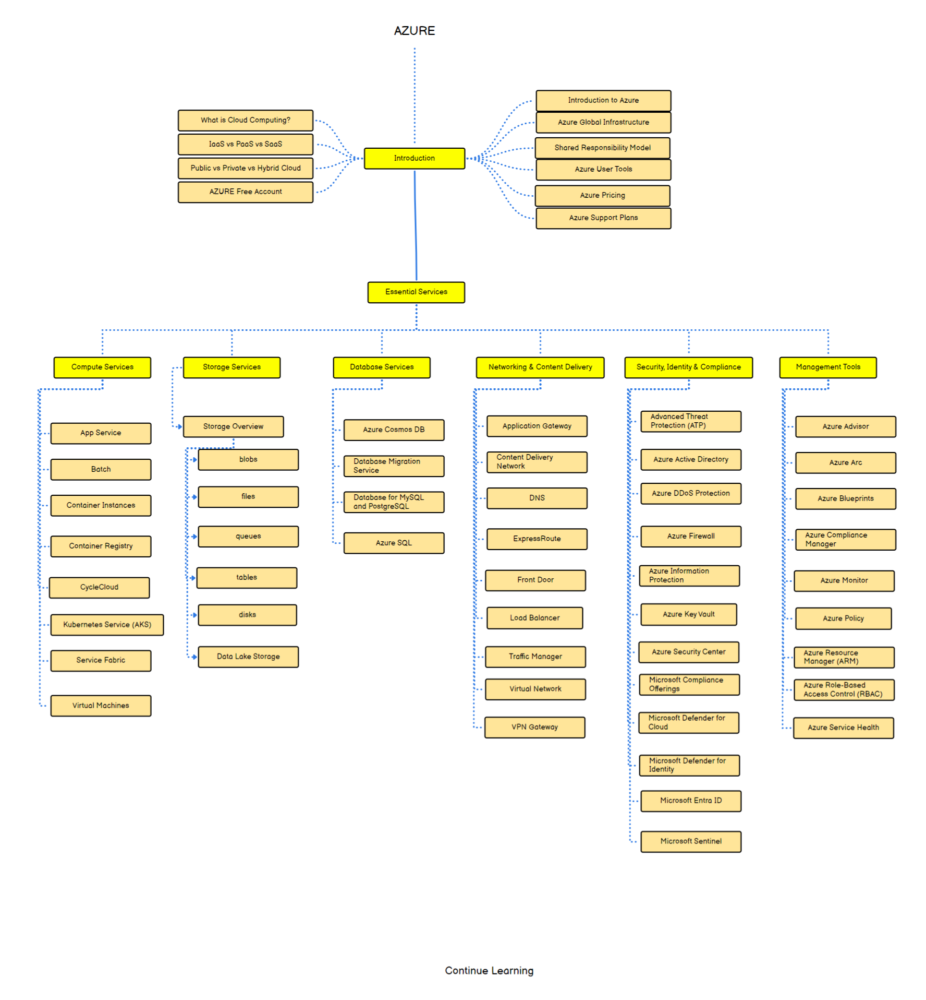

# Azure Fundamentals Course

Welcome to the Azure Fundamentals course! This course will provide you with a solid foundation in Microsoft Azure and its core services.

## Course Overview

This course will cover the following key topics:

1. **Introduction to Cloud Computing:** Understand the fundamentals of cloud computing and how Microsoft Azure fits into the cloud landscape.

2. **Azure Services Overview:** Explore essential Azure services such as Azure Virtual Machines, Azure Storage, Azure App Services, Azure SQL Database, and Azure Active Directory.

3. **Azure Management Tools:** Learn about Azure management tools like Azure Portal, Azure CLI, Azure PowerShell, and Azure Resource Manager (ARM) templates.

4. **Security and Compliance:** Understand Azure security features, identity management, and compliance standards like GDPR and ISO/IEC 27001.

5. **Scalability and High Availability:** Explore techniques for designing scalable and highly available solutions on Azure using services like Azure Load Balancer, Azure Traffic Manager, and Azure Availability Zones.

## Course Materials

Access the course materials and additional resources from the following link:

[Course Materials](https://drive.google.com/file/d/1bYc5gmcXRHL3HpJO9RQj-cqClmWEyPVr/view?usp=sharing)

## Roadmap

Below is the roadmap for the Azure Fundamentals course:

This roadmap outlines the key topics and milestones you'll cover throughout the course.
