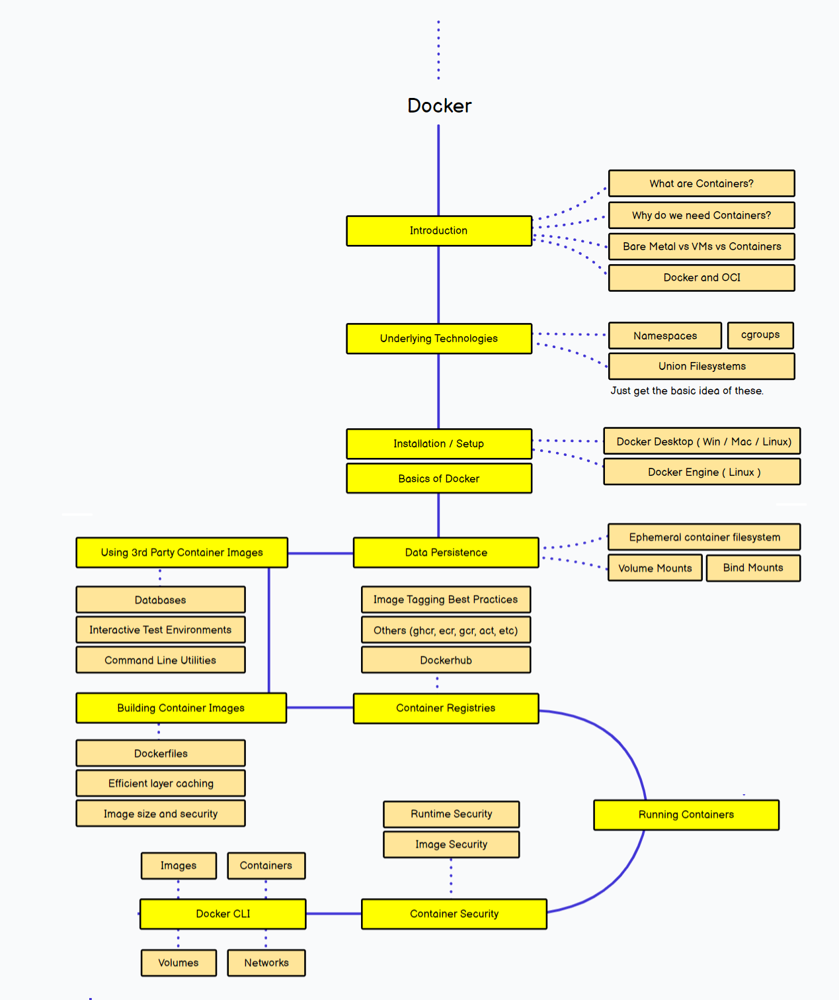
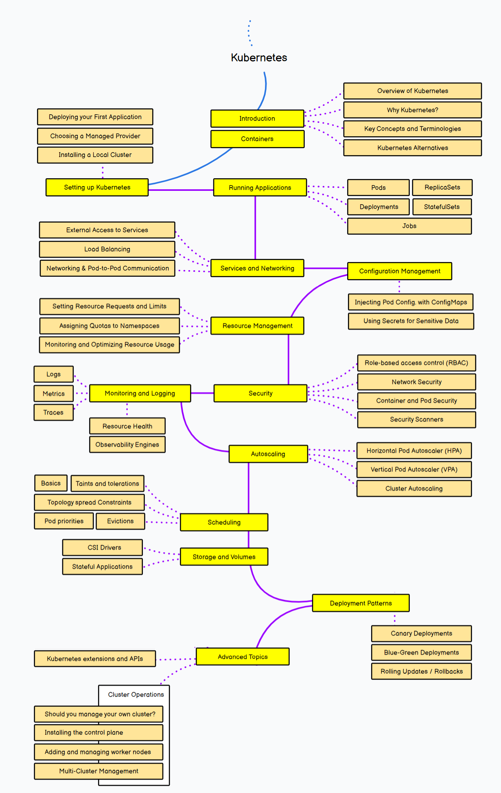

# Docker and Kubernetes Course

Welcome to the Docker and Kubernetes course! In this course, we will cover the fundamentals and advanced concepts of containerization and orchestration using Docker and Kubernetes.

## Course Overview

This course will cover the following key topics:

1. **Introduction to Containers:** Understand the basics of containerization, its benefits, and how Docker fits into the container ecosystem.

2. **Docker Basics:** Learn about Docker architecture, installation, Docker CLI, Dockerfile, and creating and managing Docker containers and images.

3. **Introduction to Kubernetes:** Understand the core concepts of Kubernetes, including clusters, nodes, pods, and services.

4. **Kubernetes Architecture:** Learn about the architecture of Kubernetes, including the control plane, kube-scheduler, kube-controller-manager, kubelet, and kube-proxy.

5. **Kubernetes Objects:** Explore essential Kubernetes objects like Deployments, StatefulSets, DaemonSets, ConfigMaps, Secrets, and Persistent Volumes.

6. **Kubernetes Networking:** Understand Kubernetes networking concepts, including Services, Ingress, Network Policies, and DNS.

7. **CI/CD with Docker and Kubernetes:** Learn how to integrate Docker and Kubernetes into CI/CD pipelines for automating the build, test, and deployment processes.

8. **Monitoring and Logging:** Explore tools for monitoring and logging containerized applications in Kubernetes.

9. **Security and Best Practices:** Understand best practices for securing Docker containers and Kubernetes clusters, including image security, pod security policies, and RBAC.

## Course Materials

Access the course materials and additional resources from the following link:

[Course Materials](https://drive.google.com/file/d/16R180yLXReJ-_O_u672YGw58WERwZUIx/view?usp=sharing)

## Roadmap

Below is the roadmap for the Docker and Kubernetes course:

 

This roadmap outlines the key topics and milestones you'll cover throughout the course.
