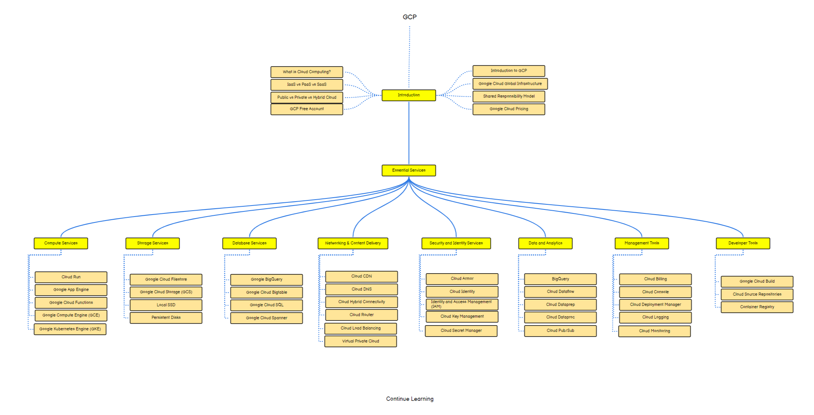

# Google Cloud Platform (GCP) Fundamentals Course

Welcome to the Google Cloud Platform (GCP) Fundamentals course! This course will provide you with a comprehensive understanding of the Google Cloud Platform and its core services.

## Course Overview

This course will cover the following key topics:

1. **Introduction to Cloud Computing:** Understand the fundamentals of cloud computing and how Google Cloud Platform (GCP) provides scalable and reliable cloud services.

2. **GCP Core Infrastructure:** Explore essential GCP services such as Compute Engine, Cloud Storage, Virtual Private Cloud (VPC), and Identity and Access Management (IAM).

3. **GCP Management Tools:** Learn about GCP management tools like Google Cloud Console, Cloud SDK (gcloud), and Cloud Shell for managing GCP resources and deploying applications.

4. **Security and Compliance:** Understand GCP security features, encryption options, and compliance standards such as HIPAA and GDPR.

5. **Scalability and High Availability:** Explore techniques for designing scalable and highly available architectures on GCP using services like Google Kubernetes Engine (GKE), Cloud Load Balancing, and Cloud CDN.

## Course Materials

Access the course materials and additional resources from the following link:

[Course Materials](https://drive.google.com/file/d/1zByAIRpO1gLrBbduwAV5Z-48zF1Ivpfl/view?usp=sharing)

## Roadmap

Below is the roadmap for the GCP Fundamentals course:

This roadmap outlines the key topics and milestones you'll cover throughout the course.
