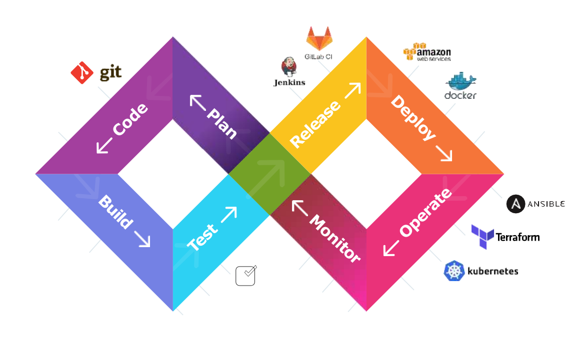

 

# Welcome to DevOpsBuddies

## Your Partner in DevOps, Cloud, and Containerization Excellence

At DevOpsBuddies, we specialize in providing top-notch training and support services in DevOps, cloud computing, and containerization. Our mission is to empower individuals and organizations with the skills and knowledge needed to excel in today's rapidly evolving tech landscape.

### Our Offerings:

- **DevOps Training**: Master the principles and practices of DevOps to enhance collaboration and efficiency within your organization.
- **Cloud Computing Training**: Gain in-depth knowledge and hands-on experience with leading cloud platforms.
- **Containerization Training**: Learn to streamline your development and deployment processes with container technologies like Docker and Kubernetes.
- **Support Services**: Benefit from our expert support to ensure your projects run smoothly and efficiently.

### Why Choose DevOpsBuddies?

- **Expert Instructors**: Our trainers are industry professionals with extensive experience.
- **Hands-On Learning**: Practical exercises and real-world projects ensure you gain valuable skills.
- **Flexible Scheduling**: Courses and support services are available to fit your schedule.
- **Community & Networking**: Join a community of like-minded professionals and expand your network.

### Get Started Today!

For more information or to schedule a demo, please reach out to us. We're here to help you achieve your goals and drive success in your tech initiatives.

---

**Contact Us:**

- **Phone**: +91-9381760268 ( WhatsApp Available)

Follow us on [Instagram](https://www.instagram.com/devopsbuddies/) | [Twitter](https://twitter.com/devopsbuddies) | [YouTube](https://www.youtube.com/@DevopsBuddies) | [Blog](https://blog.devopsbuddies.in) | [GitHub](https://github.com/DevOpsBuddies) 

